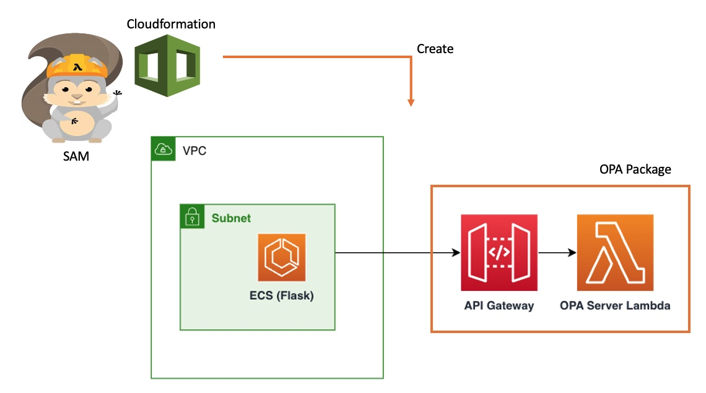

# demogo - OPA (Open Policy Agent)와 SAM/CF를 이용한 Multi-Tenancy 서비스 구축

##  구성하게 되면 다음과 같은 아키텍쳐가 생성됩니다. 도커 이미지를 ECR에 올리는 것 외에는 모든 것이 SAM과 CF를 통해 자동화되어 있습니다! 

##  계속 진행하기 위해서는 다음의 임무를 완수해야 합니다. 임무들을 완성하면 나중에도 도움이 될 겁니다. 

### [AWS CLI 설치](https://docs.aws.amazon.com/ko_kr/cli/latest/userguide/getting-started-install.html)
### [Git 설치](https://github.com/git-guides/install-git)
### [Docker 설치](https://docs.docker.com/get-docker/)
### [SAM 설치](https://docs.aws.amazon.com/ko_kr/serverless-application-model/latest/developerguide/serverless-sam-cli-install.html)
### [Python 3.9 버젼 설치](https://www.python.org/downloads/release/python-3915/)

##  완료했으면, 서비스를 만들 소스를 GitHub에서 받아옵니다. 
