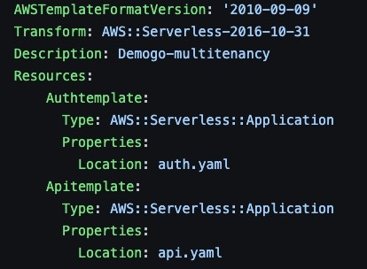

# OPA와 SAM/CF를 이용한 Multi-Tenancy 서비스 구축

###  [OPA](https://www.openpolicyagent.org/) 는 Open Policy Agent의 약자로 서비스를 할 때에 필수적인 policy를 code화 해서 따로 서버를 운영하며, 이를 통해 서비스와 policy를 분리할 수 있게 해주는 Agent입니다. 다양한 분야에서 이용할 수 있지만, 여기에서는 OPA를 통해서 Multi-Tenancy를 구축하는 것에 대해서 다루어 보려고 합니다. 

#### Lee Real Estate 서비스는 부동산 서비스로, 유주택자에게 어떤 아파트로 갈아타는 것이 좋을지에 대한 가이드를 제시합니다. 단, 프리미엄 고객에게만요. Multi-Tenancy로 분리되어 있는 일반 고객과 프리미엄 고객에게는 tier에 따라 다른 서비스를 제공하게 되는데요, OPA를 통해서 이를 간단하게 만들 수 있습니다. 이를 바탕으로 아래의 흐름을 가진 서비스를 만들어 볼 것입니다.


####  흐름은 이렇습니다. 자동으로 생성되는 User 의 정보로 Login을 하게 되면, 이 User의 Tier정보를 확인합니다. 확인후, OPA Server에 Tier정보와 서비스에 필요한 Role 정보를 가지고 Request를 하게 되며, 이 결과에 따라서 User별 다른 서비스가 제공됩니다. 이 서비스를 만들기 위해 아래의 아키텍쳐를 빌드할 것입니다. 도커 이미지를 ECR에 올리는 것 외에는 모든 것이 SAM과 CF를 통해 자동화되어 있습니다! 


#### 아키텍쳐를 보면, 1. ECS 위에서 Flask 서버를 통해 운영되고 있는 웹 서비스와 2. API gateway 와 Lambda를 통해 웹 서비스와는 별개로 제공되는 OPA Package가 있습니다. 3. Cognito의 경우 로그인 기능과 유저의 tier 및 정보를 저장하는 User DB 역할을, DynamoDB의 경우 아파트의 정보를 저장하는 역할을 합니다. ECS는 VPC 내부에 있는 Subnet 안에 존재하고 있어, 기업의 리소스를 나타내며, OPA Package 는 이와는 분리되어 따로 동작하는 형태로, 서비스를 제공할 때에 Policy를 분리해서 따로 관리할 수 있습니다.

####  계속 진행하기 위해서는 다음의 임무를 완수해야 합니다. 임무들을 완성하면 나중에도 도움이 될 겁니다. 

##### [AWS CLI 설치](https://docs.aws.amazon.com/ko_kr/cli/latest/userguide/getting-started-install.html)
##### [Git 설치](https://github.com/git-guides/install-git)
##### [Docker 설치](https://docs.docker.com/get-docker/)
##### [SAM 설치](https://docs.aws.amazon.com/ko_kr/serverless-application-model/latest/developerguide/serverless-sam-cli-install.html)
##### [Python 3.9 버젼 설치](https://www.python.org/downloads/release/python-3915/)

#### 임무를 완료했으면, 서비스를 만들 소스를 GitHub에서 받아옵니다. 
```bash
mkdir opa-service
cd opa-service
git clone https://github.com/smileinthebluesky/demogo.git
```

#### 잘 받아왔으면, Dockerfile을 이용해서 docker image를 생성합니다. 이때, docker가 running하는 상태여야 합니다.
```bash
cd demogo
docker build -t opa-service:latest . 
```
#### 시간이 조금 걸릴 수 있습니다. 차분히 기다립니다. Dockerfile이 있는 위치에서 docker build를 사용하셔야 합니다. 뒤에 . 도 잊지마세요! 완성되면 다음 명령어를 통해 이미지 생성을 확인합니다.
```bash
docker images
```

#### AWS Image Repository인 ECR에 로그인하고, Repository를 만듭니다.
```bash
aws ecr get-login-password --region ap-northeast-2 | docker login --username AWS --password-stdin 계정번호.dkr.ecr.ap-northeast-2.amazonaws.com
aws ecr create-repository --repository-name opaservice --region ap-northeast-2
```

#### 이제 docker image에 tagging을 하고, 아까 만든 repository로 이미지를 push합니다. 
```bash
docker tag opa-service:latest 계정번호.dkr.ecr.ap-northeast-2.amazonaws.com/opaservice:latest
docker push 계정번호.dkr.ecr.ap-northeast-2.amazonaws.com/opaservice:latest
```

#### [ECR](https://ap-northeast-2.console.aws.amazon.com/ecr/repositories?region=ap-northeast-2)에 접속해서 방금 만든 opaservice repository에 들어갑니다. Image URI 항목 아래의 Copy URI 를 눌러 URI를 카피해서 메모장에 저장합니다.


#### 이제 본격적으로 서비스 빌드를 해보겠습니다. /demogo/demogo-multitenancy 경로에 있는 api.yaml 파일을 IDE로 오픈하고, 아래의 'here' 부분 (16번째 줄) 을 아까 저장했던 URI 로 치환합니다.
```
ContainerDefinitions:
        - Name: web
          Essential: true
          Image: here
          PortMappings:
            - ContainerPort: 80
              HostPort: 80
              Protocol: tcp
```

#### 바꿨으면 저장하고 /demogo/demogo-multitenancy 로 다시 되돌아 옵니다. 그리고 아래 명령어를 수행합니다. [SAM](https://docs.aws.amazon.com/ko_kr/serverless-application-model/latest/developerguide/what-is-sam.html) 은 다양한 기능들을 사용해 손쉽게 application을 구축할 수 있게 도와주는 다람쥐 서비스입니다.

```bash
sam build
sam deploy --guided --stack-name opa-service --capabilities CAPABILITY_IAM CAPABILITY_AUTO_EXPAND
```

#### Deploy를 할때의 선택지는 아래를 참고하세요. 마지막 선택지까지 고르면 잠시 멈춘듯한 현상이 있는데 지극히 정상이니 걱정하지 마세요.


#### 완료되면 다음과 같이 보입니다. 이제 마음껏 서비스를 이용할 수 있습니다. 초기 데이터 적재와 초기 유저는 모두 생성되어 있습니다.


#### [ECS](https://ap-northeast-2.console.aws.amazon.com/ecs/home?region=ap-northeast-2#/clusters) 콘솔로 들어가면, CFNCluster가 만들어져 있을 것입니다. Service가 있는 것을 확인하고, CFNCluster를 클릭해서 메뉴로 들어갑니다. 들어가서 Services 탭 > Service Name 탭 아래의 cfn-service 클릭 > Task 탭 선택 후, 아래의 Task 탭 아래의 Task 명 선택 > Public IP 찾아서 복사 하는 과정을 거칩니다.  그 다음, 아래의 주소로 들어갑니다. 화면이 성공적으로 호출됩니다.

```
http://publicIp/index
```


#### 현재 서비스에서는 일반 회원인 apple과 프리미엄 회원인 penguin이 이미 가입되어 있습니다. 아래의 정보를 입력해서 로그인해보세요. 이상한 값을 넣으면 에러로 떨어집니다. 

|ID|Password|
|------|---|
|penguin@amazon.com|12345dgda67|
|apple@amazon.com|12345dgda67|

#### 프리미엄 회원인 penguin은 아래의 서비스를 누릴 수 있습니다. 자신의 아파트와 비슷한 대조군의 아파트가 보여지며, 가격 추세도 한 눈에 볼 수 있습니다.


#### 일반 회원인 apple은 다소 밋밋한 화면만을 보게 되네요. 


#### 이제 서비스는 살펴보았으니, 내부를 한번 살펴보겠습니다. Demogo-multitenancy 폴더에 들어가 보면, 폴더들과 yaml 파일들을 볼 수 있습니다.


#### 여기에서 template.yaml 파일은 SAM 에서 사용하는 기본 Cloudformation 설정 파일로, 이 설정 파일을 통해 AWS Resource들을 쉽게 올릴 수 있습니다. 이 안에 auth.yaml과 api.yaml을 포함시켜 놓았습니다.


#### auth.yaml에서는 Cognito와 Opa package, DynamoDB를 생성하게 되며, api.yaml에서는 ECS와 관련된 자원을 만듭니다. 이렇게 두개의 tempalte이 다른 역할을 하면서 분리되어 있기 때문에, 나중에 따로 쓰기도 용이하고, 실패시 해당 stack 만을 따로 관리할 수 있어 좋습니다. 이제 demogo/demogo-multitenancy/demogo 폴더로 들어가 보겠습니다. init_cognito.py 와 init_dynamo.py 파일이 먼저 보일겁니다. 이는 서비스가 잘 작동할 수 있도록, 미리 유저를 생성하고 아파트 정보를 넣어주는 용도입니다. auth.yaml 로 만들어지는 리소스에서 이를 이용하고 있습니다. 

